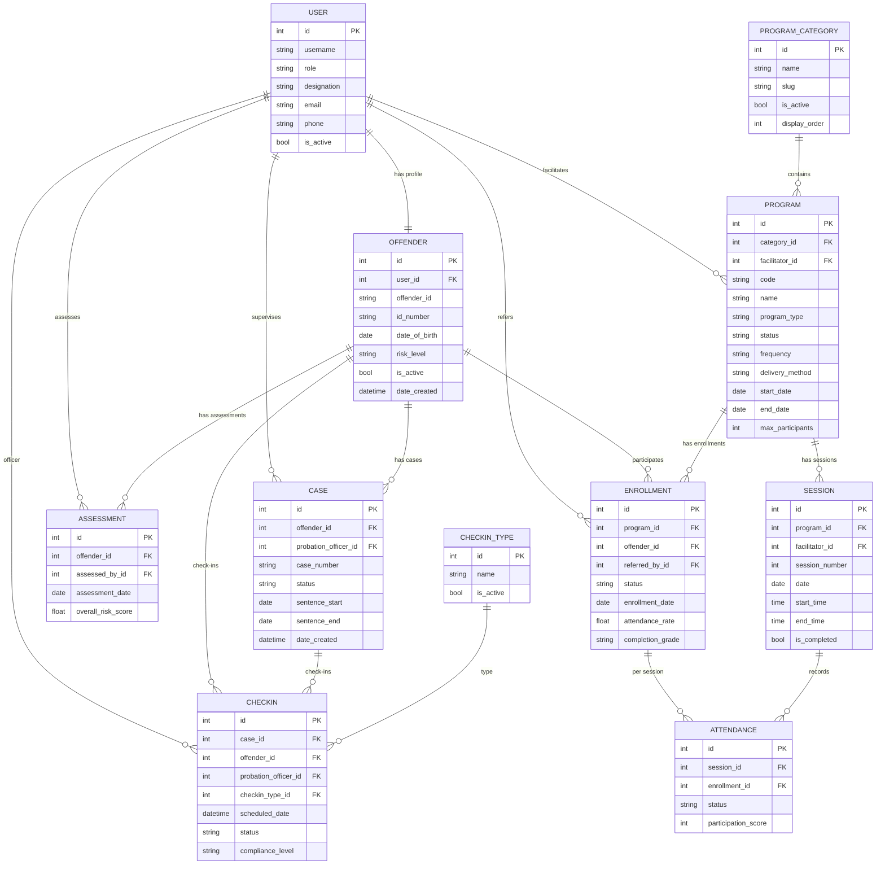

# Data Model

This system uses a relational model built around offender supervision and program participation.

## Entity relationship diagram (ERD)

## Design notes
- **Officer assignment** is stored on `Case` (`probation_officer_id`), which aligns supervision to the legal context.
- `Enrollment` is unique per `(program, offender)` to prevent duplicate enrollments.
- Program delivery is expressed through `Session` and tracked via `Attendance`.

