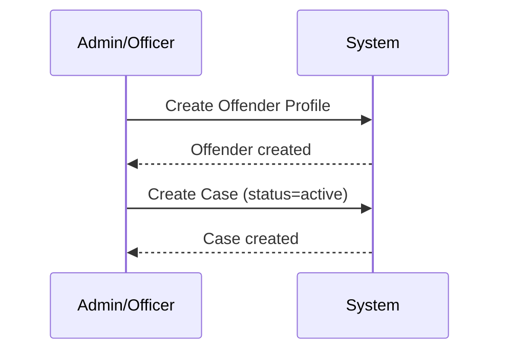
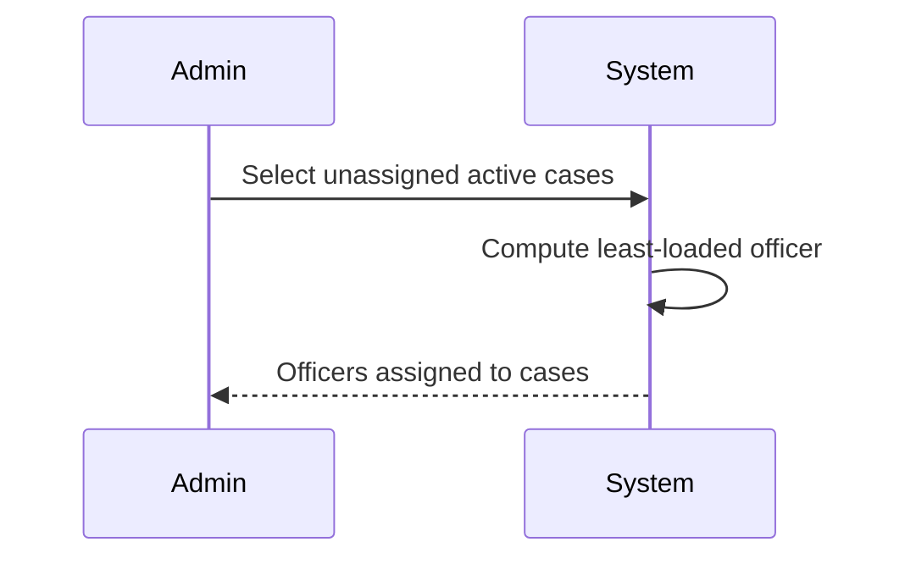
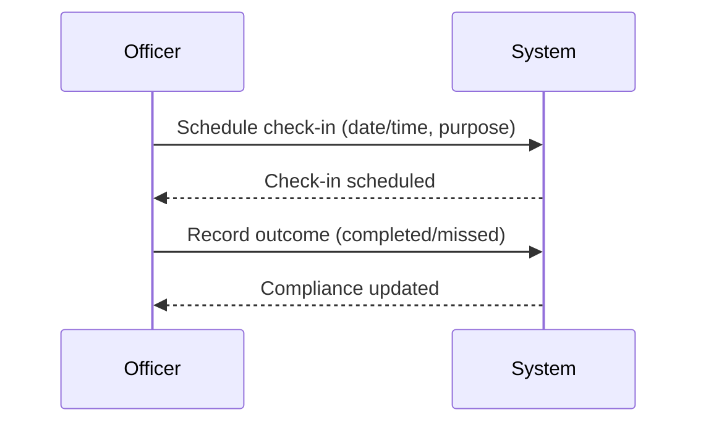
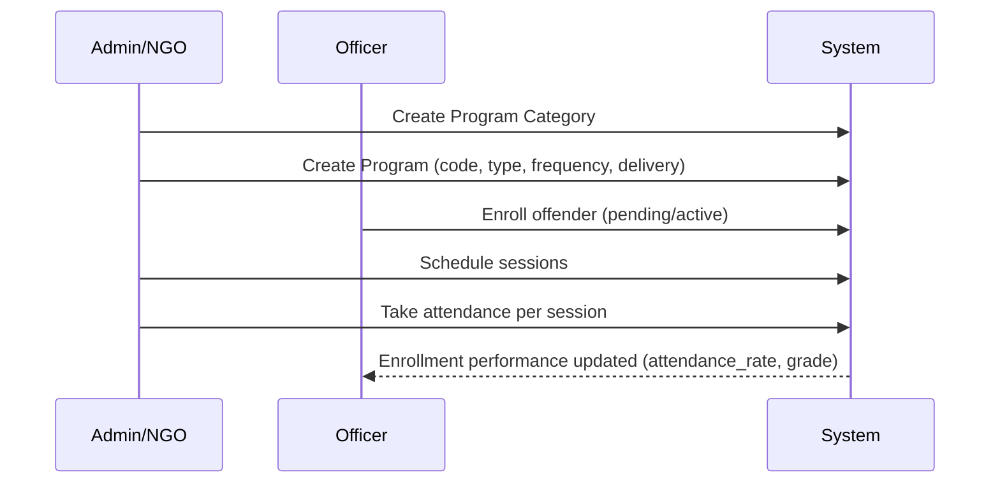

# Workflows (Design Phase)

This document describes the intended end-to-end user flows.

## High-level system flowchart
```mermaid
flowchart TD
    A[Login] --> B{Role?}

    B -->|Admin| C[Admin Dashboard]
    B -->|Officer| D[Officer Dashboard]
    B -->|Offender| E[Offender Dashboard]
    B -->|Judiciary/NGO| F[Partner Dashboard]

    C --> C1[User & Officer Management]
    C --> C2[Offenders & Cases]
    C --> C3[Programs Catalog]
    C --> C4[Monitoring & Compliance]
    C --> C5[Reports & Analytics]

    C2 --> G[Create/Update Offender]
    G --> H[Create/Update Case]
    H --> I{Officer Assigned?}
    I -->|No| J[Auto-Assign (Least-Loaded)]
    I -->|Yes| K[Supervision Starts]
    J --> K

    K --> L[Schedule Check-in]
    L --> M{Outcome}
    M -->|Completed| N[Record Notes & Compliance]
    M -->|Missed| O[Flag Non-Compliance]
    M -->|Rescheduled| L

    K --> P[Assessments]
    P --> Q[Update Risk Level]

    C3 --> R[Create Categories & Programs]
    R --> S[Enroll Offender]
    S --> T[Schedule Sessions]
    T --> U[Take Attendance]
    U --> V[Track Completion/Certificates]

    D --> D1[My Cases & Offenders]
    D1 --> L
    D1 --> P
    D1 --> S

    E --> E1[View Active Case]
    E1 --> E2[View Assigned Officer]
    E1 --> E3[View Check-in Schedule/History]
    E1 --> E4[View Program Enrollment]

    C5 --> W[Generate Reports]
    N --> W
    O --> W
    V --> W
```

## 1) Intake: Create offender → create case


## 2) Assign officer to case (auto assignment)


## 3) Monitoring: schedule check-in → complete/missed


## 4) Programs: create category/program → enroll offender → sessions → attendance


## 5) Reporting: operational and outcome reporting
- Caseload summary (per officer, per status).
- Compliance summary (scheduled vs completed vs missed).
- Program outcomes (completion rate, attendance, certificates).
